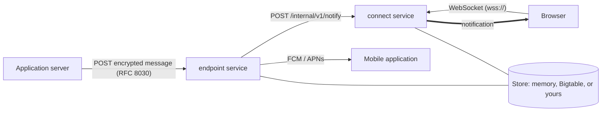

# webpush-service

A reference implementation of an IETF Web Push service in Rust. Application servers talk to it exactly as RFC 8030 and RFC 8292 specify. Browsers connect with the WebSocket protocol Firefox uses, so a stock Firefox can use it as its push server. Mobile applications register a platform device token and receive messages through Firebase Cloud Messaging (FCM) or the Apple Push Notification service (APNs).

The service runs as one process for development, or as two separately scaled services in production. Its storage, bridges, and policies sit behind small interfaces and configuration.

The goal is a push service that is correct first and readable second. Every requirement is covered by a test that cites it.



## Crates

| Crate | Purpose |
|---|---|
| [`webpush-server`](crates/webpush-server) | The service: endpoint and connect roles, configuration, telemetry, graceful shutdown. Builds the `webpush-server` binary |
| [`webpush-store`](crates/webpush-store) | The `Store` trait, its executable contract, and the memory and Bigtable adapters |
| [`webpush-bridge`](crates/webpush-bridge) | The `Bridge` trait between the service and platform push services |
| [`webpush-fcm`](crates/webpush-fcm) | FCM HTTP v1 bridge, with OAuth 2.0 service account tokens |
| [`webpush-apns`](crates/webpush-apns) | APNs bridge, with ES256 provider tokens |
| [`webpush-crypto`](crates/webpush-crypto) | RFC 8188 and RFC 8291 message encryption and RFC 8292 VAPID verification, with no I/O |

Dependencies point one way: `webpush-server` depends on the other crates, and the bridge crates depend only on `webpush-bridge`. A new storage adapter depends only on `webpush-store`.

## Specifications

| Specification | Title | Implemented as |
|---|---|---|
| [RFC 8030](https://www.rfc-editor.org/rfc/rfc8030) | Generic Event Delivery Using HTTP Push | Push requests, TTL, urgency, topics, delivery receipts, message resources. The user agent side (§4 subscribe, §6 delivery over HTTP/2 server push) is replaced, see below |
| [RFC 8292](https://www.rfc-editor.org/rfc/rfc8292) | Voluntary Application Server Identification (VAPID) for Web Push | Restricted subscriptions and credential checks on push; `webpush_crypto::vapid` |
| [RFC 8291](https://www.rfc-editor.org/rfc/rfc8291) | Message Encryption for Web Push | `webpush_crypto::ece::webpush`, for application servers and clients |
| [RFC 8188](https://www.rfc-editor.org/rfc/rfc8188) | Encrypted Content-Encoding for HTTP | `webpush_crypto::ece` (`aes128gcm`) |
| [Firefox push protocol](https://firefox-source-docs.mozilla.org/dom/push/) | WebSocket protocol between Firefox and its push server | The browser side: sessions, subscriptions, delivery, acknowledgement |

RFC 8030 delivers messages to user agents, and receipts to application servers, with HTTP/2 server push. Chrome 106 and Firefox 132 removed server push, and no browser ever used RFC 8030 for Web Push delivery. This service therefore speaks Firefox's WebSocket protocol to browsers, uses platform bridges for mobile applications, and streams receipts as Server-Sent Events. Everything an application server sees is unchanged. [Architecture](docs/architecture.md) explains the decision, and the [design spec](TECH_SPEC.md#46-deviations-from-rfc-8030) lists the deviations requirement by requirement.

The service also relies on these specifications:

| Specification | Title | Used for |
|---|---|---|
| [RFC 6455](https://www.rfc-editor.org/rfc/rfc6455) | The WebSocket Protocol | Browser sessions |
| [WHATWG HTML, Server-sent events](https://html.spec.whatwg.org/multipage/server-sent-events.html) | Server-sent events | Receipt streams |
| [RFC 9110](https://www.rfc-editor.org/rfc/rfc9110), [RFC 9112](https://www.rfc-editor.org/rfc/rfc9112), [RFC 9113](https://www.rfc-editor.org/rfc/rfc9113) | HTTP semantics, HTTP/1.1, HTTP/2 | Transport. They supersede the RFC 7230 to 7235 and RFC 7540 references in RFC 8030 |
| [RFC 7240](https://www.rfc-editor.org/rfc/rfc7240) | Prefer Header for HTTP | `Prefer: respond-async` and `Prefer: wait=0` |
| [RFC 8288](https://www.rfc-editor.org/rfc/rfc8288) | Web Linking | The receipt subscription `Link` |
| [RFC 7515](https://www.rfc-editor.org/rfc/rfc7515), [RFC 7519](https://www.rfc-editor.org/rfc/rfc7519) | JSON Web Signature, JSON Web Token | VAPID tokens, FCM service account assertions, APNs provider tokens |
| [RFC 5869](https://www.rfc-editor.org/rfc/rfc5869) | HMAC-based Key Derivation Function (HKDF) | Key derivation in RFC 8188 and RFC 8291 |

Two errata in the RFC examples are accounted for in the tests: the RFC 8188 §3.1 body is 53 octets, not 54, and the RFC 8291 §5 body is 144 octets, not 145.

## Quick start

To run a single node with in-memory state, create a development certificate and a two-line configuration, then start the binary. [Running the service](docs/running.md) explains each step.

```bash
openssl req -x509 -newkey ec -pkeyopt ec_paramgen_curve:prime256v1 -nodes -days 30 \
  -subj "/CN=localhost" -addext "subjectAltName=DNS:localhost" -keyout key.pem -out cert.pem
cat > webpush.toml <<'EOF'
origin = "https://localhost:8443"
[public.tls]
cert_file = "cert.pem"
key_file = "key.pem"
EOF
cargo run --release -p webpush-server -- --config webpush.toml
```

To use it from Firefox, trust `cert.pem` in Firefox, set `dom.push.serverURL` to `wss://localhost:8443/` in `about:config`, and restart Firefox.

[`config/webpush.example.toml`](config/webpush.example.toml) lists every setting with its default. Any setting can also come from a `WEBPUSH_*` environment variable, for example `WEBPUSH_CLUSTER__TOKEN`.

## Deployment

One binary runs in one of three roles:

| Role | Serves | Scales by |
|---|---|---|
| `all` | Everything in one process | Not at all; for development and small deployments |
| `endpoint` | Application servers: push, message and receipt resources, the mobile registration API | Adding stateless replicas |
| `connect` | Browser WebSocket sessions | Adding nodes, each holding its share of the connections |

In a cluster, a connect node records itself in the store as the route to each session it holds, and endpoint nodes forward messages to it over an authenticated internal API. Messages are stored before they are forwarded, so a lost forward is recovered from storage on the next connection. Every process has graceful shutdown (readiness fails, sessions close with 1001, in-flight requests finish), a connection limit, structured logs, Prometheus metrics, and health and readiness probes. [Deployment](docs/deployment.md) covers topology, load balancers, and Kubernetes.

## Storage

The service takes any implementation of the `webpush_store::Store` trait:

| Adapter | Status |
|---|---|
| `MemoryStore` | Default. Complete. State is lost on restart, and nodes cannot share it, so it suits `role = "all"` only |
| `BigtableStore` | `--features bigtable`. Passes the contract and the full conformance suite against the Bigtable emulator. It connects over plaintext gRPC without Google authentication, so it cannot reach Cloud Bigtable yet |
| Your own | Implement `Store`, then prove it with `webpush_store::contract::check`. See [Storage adapters](docs/storage-adapters.md) |

## Mobile applications

A mobile application registers its FCM or APNs device token through the registration API, receives a secret, and manages subscriptions over HTTPS. Messages reach the application as platform data messages with the same fields as the WebSocket `notification` message: `channelID`, `version`, `data`, and `encoding`. Both bridges authenticate with tokens: an OAuth 2.0 access token from a service account for FCM, and an ES256 provider token from a `.p8` key for APNs. See [Mobile bridges](docs/mobile-bridges.md).

## Documentation

- [Web Push concepts](docs/concepts.md): actors, identifiers, and the message lifecycle
- [Running the service](docs/running.md) and [Configuration](docs/configuration.md)
- [Deployment](docs/deployment.md): scaling, load balancers, probes, shutdown
- [Connecting a client](docs/connecting-a-client.md) and [Mobile bridges](docs/mobile-bridges.md)
- [Connecting a publisher](docs/connecting-a-publisher.md): VAPID keys, signed requests, receipts
- [Sending a message](docs/sending-a-message.md): one message end to end
- [Privacy and security](docs/privacy-and-security.md): what each party can learn
- [Storage adapters](docs/storage-adapters.md): using the database of your choice
- [Architecture](docs/architecture.md): crates, roles, delivery, and tradeoffs
- [WebSocket protocol reference](docs/websocket-protocol.md) and [HTTP reference](docs/http-reference.md)

## Using the encryption library

Application servers and clients written in Rust can use `webpush-crypto` without the service:

```rust
use webpush_crypto::ece::webpush;

let body = webpush::encrypt(&ua_public, &auth_secret, &ephemeral_private, &salt, b"hello")?;
let plaintext = webpush::decrypt(&ua_private, &auth_secret, &body)?;
```

`cargo doc --open` shows the full API with examples based on the RFC test vectors.

## Development

```bash
cargo test --workspace                                                 # everything, memory store
cargo test --workspace --all-features                                  # adds the Bigtable contract check
PUSH_TEST_STORE=bigtable cargo test -p webpush-server --features bigtable  # conformance suite on Bigtable
cargo clippy --workspace --all-targets --all-features -- -D warnings   # pedantic, see Cargo.toml
```

The Bigtable tests need the gcloud Bigtable emulator (`gcloud components install bigtable`) or `$CBTEMULATOR` pointing at the `cbtemulator` binary.

## Status

Complete for the application server side of RFC 8030 and RFC 8292, for Firefox's browser protocol, and for FCM and APNs delivery, on one node or split into endpoint and connect services. Not yet available:

- A production storage adapter. The Bigtable adapter lacks TLS and Google authentication on its gRPC channel.
- Rate limiting of application servers.
- Broadcasts, which the WebSocket protocol defines but Web Push does not use.
