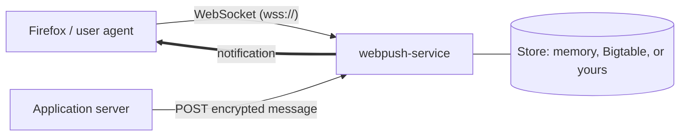

# webpush-service

A reference implementation of an IETF Web Push service in Rust. Application servers talk to it exactly as RFC 8030 and RFC 8292 specify. User agents connect with the WebSocket protocol Firefox uses, so a stock Firefox can use this service as its push server. The RFC 8291 and RFC 8188 message encryption is included as a library for application servers and clients.

The goal is a push service that is correct first and readable second: every requirement is covered by a test that cites it.



## Specifications

| Specification | Title | Implemented as |
|---|---|---|
| [RFC 8030](https://www.rfc-editor.org/rfc/rfc8030) | Generic Event Delivery Using HTTP Push | Push requests, TTL, urgency, topics, delivery receipts, message resources. The user agent side (§4 subscribe, §6 delivery over HTTP/2 server push) is replaced, see below |
| [RFC 8292](https://www.rfc-editor.org/rfc/rfc8292) | Voluntary Application Server Identification (VAPID) for Web Push | Restricted subscriptions and credential checks on push; the `vapid` module |
| [RFC 8291](https://www.rfc-editor.org/rfc/rfc8291) | Message Encryption for Web Push | The `ece::webpush` module, for application servers and clients |
| [RFC 8188](https://www.rfc-editor.org/rfc/rfc8188) | Encrypted Content-Encoding for HTTP | The `ece` module (`aes128gcm`) |
| [Mozilla push protocol](https://firefox-source-docs.mozilla.org/dom/push/) | WebSocket protocol between Firefox and its push service | The user agent side: sessions, subscriptions, delivery, acknowledgement |

RFC 8030 delivers messages to user agents, and receipts to application servers, with HTTP/2 server push. Chrome 106 and Firefox 132 removed server push, and no browser ever used RFC 8030 for Web Push delivery, so this service speaks Firefox's WebSocket protocol to user agents and streams receipts as Server-Sent Events. Everything an application server sees is unchanged. [Architecture](docs/architecture.md#why-the-user-agent-side-is-a-websocket) explains the decision, and the deviations are listed requirement by requirement in the [design spec](TECH_SPEC.md#46-deviations-from-rfc-8030).

The service also relies on these specifications:

| Specification | Title | Used for |
|---|---|---|
| [RFC 6455](https://www.rfc-editor.org/rfc/rfc6455) | The WebSocket Protocol | User agent sessions |
| [WHATWG HTML, Server-sent events](https://html.spec.whatwg.org/multipage/server-sent-events.html) | Server-sent events | Receipt streams |
| [RFC 9110](https://www.rfc-editor.org/rfc/rfc9110), [RFC 9112](https://www.rfc-editor.org/rfc/rfc9112), [RFC 9113](https://www.rfc-editor.org/rfc/rfc9113) | HTTP semantics, HTTP/1.1, HTTP/2 | Transport. They supersede the RFC 7230 to 7235 and RFC 7540 references in RFC 8030 |
| [RFC 7240](https://www.rfc-editor.org/rfc/rfc7240) | Prefer Header for HTTP | `Prefer: respond-async` and `Prefer: wait=0` |
| [RFC 8288](https://www.rfc-editor.org/rfc/rfc8288) | Web Linking | The receipt subscription `Link` |
| [RFC 7515](https://www.rfc-editor.org/rfc/rfc7515), [RFC 7519](https://www.rfc-editor.org/rfc/rfc7519) | JSON Web Signature, JSON Web Token | The VAPID token format |
| [RFC 5869](https://www.rfc-editor.org/rfc/rfc5869) | HMAC-based Key Derivation Function (HKDF) | Key derivation in RFC 8188 and RFC 8291 |

Two errata in the RFC examples are accounted for in the tests: the RFC 8188 §3.1 body is 53 octets, not 54, and the RFC 8291 §5 body is 144 octets, not 145.

## Quick start

Create a development certificate and start the service. State is kept in memory, so nothing else is needed. [Running the service](docs/running.md) explains each step:

```bash
openssl req -x509 -newkey ec -pkeyopt ec_paramgen_curve:prime256v1 -nodes -days 30 \
  -subj "/CN=localhost" -addext "subjectAltName=DNS:localhost" -keyout key.pem -out cert.pem
PUSH_TLS_CERT=cert.pem PUSH_TLS_KEY=key.pem cargo run --release
```

To use it from Firefox, trust `cert.pem` in Firefox, set `dom.push.serverURL` to `wss://localhost:8443/` in `about:config`, and restart Firefox.

## Documentation

- [Web Push concepts](docs/concepts.md): actors, identifiers, and the message lifecycle
- [Connecting a client](docs/connecting-a-client.md): Firefox, or your own client
- [Connecting a publisher](docs/connecting-a-publisher.md): VAPID keys, signed requests, receipts
- [Sending a message](docs/sending-a-message.md): one message end to end
- [Privacy and security](docs/privacy-and-security.md): what each party can learn
- [Storage adapters](docs/storage-adapters.md): using the database of your choice
- [Architecture](docs/architecture.md): components, storage, and tradeoffs
- [WebSocket protocol reference](docs/websocket-protocol.md) and [HTTP reference](docs/http-reference.md)

## Storage

`serve` takes any implementation of the `store::Store` trait:

| Adapter | How to use |
|---|---|
| `MemoryStore` | Default. No setup, state is lost on restart |
| `BigtableStore` | `--features bigtable`. Cloud Bigtable over gRPC; the emulator for now |
| Your own | Implement `Store`, then prove it with `store::contract::check`. See [Storage adapters](docs/storage-adapters.md) |

## Using the encryption library

Application servers and clients written in Rust can use the crate's `ece` and `vapid` modules without running the service:

```rust
use webpush_service::ece::webpush;

let body = webpush::encrypt(&ua_public, &auth_secret, &ephemeral_private, &salt, b"hello")?;
let plaintext = webpush::decrypt(&ua_private, &auth_secret, &body)?;
```

`cargo doc --open` shows the full API with examples based on the RFC test vectors.

## Development

```bash
cargo test                                               # everything, on the memory store
cargo test --features bigtable                           # adds the Bigtable contract check
PUSH_TEST_STORE=bigtable cargo test --features bigtable  # conformance suite on Bigtable
cargo clippy --all-targets -- -D warnings
```

The Bigtable tests need the gcloud Bigtable emulator (`gcloud components install bigtable`) or `$CBTEMULATOR` pointing at the `cbtemulator` binary.

## Status

Complete for the application server side of RFC 8030 and RFC 8292 and for Firefox's user agent protocol, on a single node. Not yet implemented: production Cloud Bigtable access (TLS and authentication on the gRPC channel), rate limiting, and subscription expiry. See [Architecture: tradeoffs](docs/architecture.md#tradeoffs).
