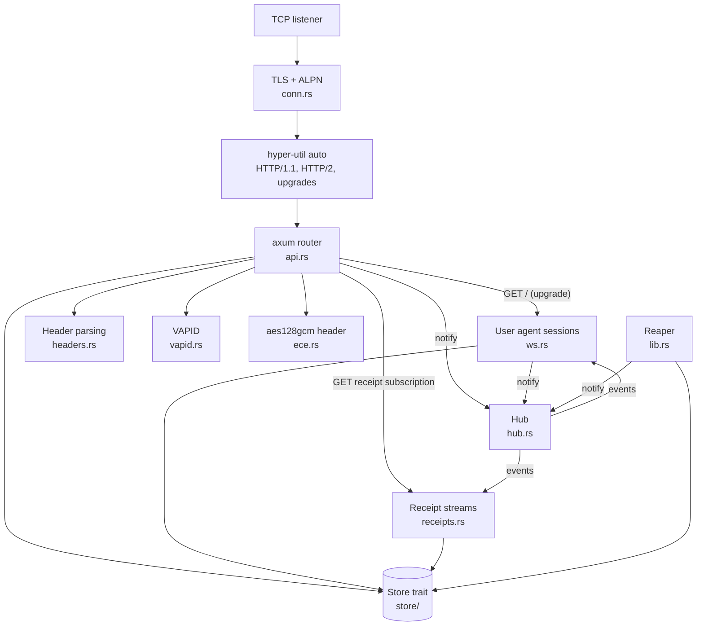
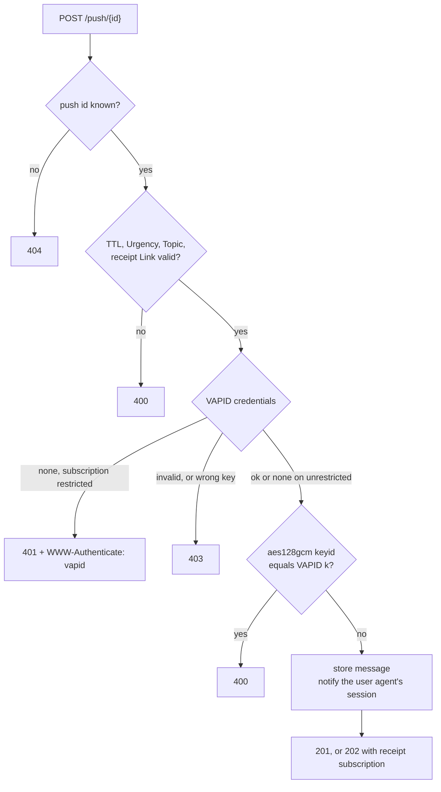
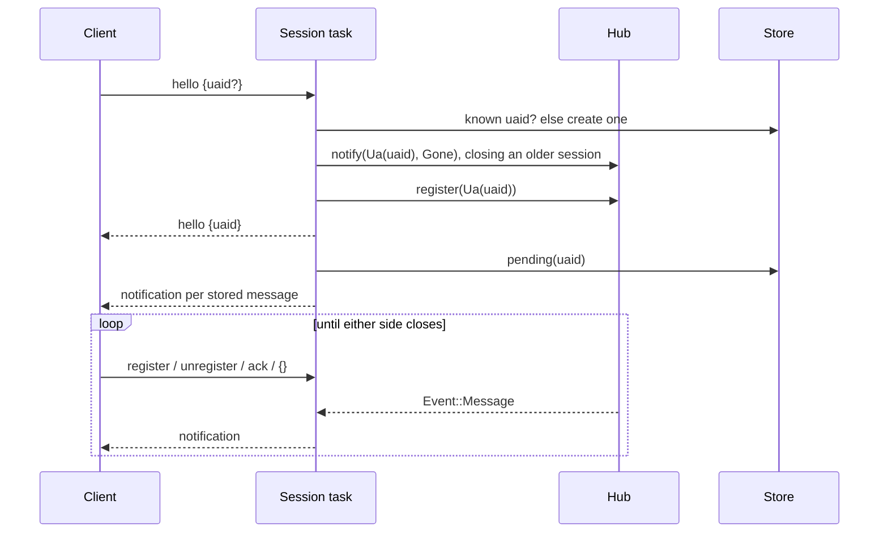

# Architecture

This page describes how the push service is built: its components, how a request moves through them, how state is stored, and which tradeoffs the design makes. Read [Web Push concepts](concepts.md) first if the protocol itself is new to you.

## Goals and scope

The service implements the application server side of RFC 8030 and RFC 8292 exactly, speaks Firefox's WebSocket protocol to user agents, and includes RFC 8188 and RFC 8291 as a library. Its goals, in order:

1. Follow the RFC text wherever it is deployed. Where an RFC leaves a choice open, the choice is documented and covered by a test whose name starts with `policy_`.
2. Work with a real browser: Firefox, with one preference changed.
3. Keep storage replaceable behind a small, tested contract.
4. Stay small enough to read in an afternoon.

It deliberately does not do rate limiting, subscription expiry, or multi-node delivery. See [Tradeoffs](#tradeoffs).

## Why the user agent side is a WebSocket

RFC 8030 §6 delivers messages to user agents, and §6.3 delivers receipts to application servers, with HTTP/2 server push. That part of the RFC has no users left:

- Chrome 106 (2022) disabled HTTP/2 server push, Firefox 132 (2024) removed it, and nginx dropped it in 1.25.1. HTTP clients that still implement it usually disable it.
- No browser ever used RFC 8030 for Web Push delivery. Firefox holds a WebSocket to Mozilla's service, Chrome uses FCM, Edge uses WNS, and Safari uses APNs.
- The W3C Push API leaves the user agent protocol unspecified.

Firefox is the only browser whose push protocol is open and whose push server can be changed. Implementing that protocol makes the service usable by a real browser. It also removes a special case from the server: hyper does not expose server push, so the previous design served HTTP/2 with the `h2` crate directly. Now every connection goes through hyper and axum.

Receipts keep their RFC 8030 role and URL, but are delivered as a Server-Sent Events stream instead of server pushes, which any HTTP client can read.

## Components

| Module | Responsibility |
|---|---|
| `lib.rs` | Public entry points (`serve`, `Config`) and the reaper task |
| `conn.rs` | TLS and handing each connection to hyper. Knows nothing about Web Push |
| `api.rs` | Push and message endpoints, VAPID enforcement, and routing to sessions and receipt streams |
| `ws.rs` | The Firefox-compatible user agent protocol |
| `receipts.rs` | Receipt streams as Server-Sent Events |
| `headers.rs` | Pure parsing of `TTL`, `Urgency`, `Topic`, `Prefer`, and `Link` |
| `hub.rs` | In-process fan-out from writers to open connections |
| `store/` | The `Store` trait, its contract checks, and the memory and Bigtable adapters |
| `ece.rs`, `vapid.rs` | Public library: RFC 8188/8291 encryption and RFC 8292 verification |

## Handling a push

The router validates a push in a fixed order, so every error maps to one status:

Bodies over the configured limit (4096 octets) are rejected with `413` by the router's body limit while they are read, before the handler runs.

## User agent sessions

A session is one WebSocket from one user agent, identified by its `uaid`:

Three rules make delivery reliable without locks:

- **Register before reading.** The session registers with the hub before it reads stored messages. A message accepted in between arrives as a live event instead of being missed. Duplicates from the overlap are dropped by message id.
- **Redeliver on reconnect.** Every new session reads all unacknowledged, unexpired messages. That is the retry RFC 8030 §6.2 asks for, with no retry timers. Firefox discards duplicates by `version`.
- **Live events skip the expiry check.** A message with TTL 0 is stored already expired, so reads of stored messages never return it, but a connected session receives it through the hub. TTL 0 needs no special case.

One session per `uaid` is active; a new `hello` for the same `uaid` closes the older connection through the hub.

## Receipt streams

`GET` on a receipt subscription opens a Server-Sent Events stream. The stream task registers with the hub, reads the queued receipts, writes them, and then writes live receipts as acknowledgements, expiries, and unsubscribes produce them. Each receipt is deleted from the queue once written, so delivery is at most once per receipt. Deleting the receipt subscription ends open streams with an `event: gone`.

## The hub

The hub maps each watched resource (a `uaid`, or a receipt subscription) to the channels of the connections watching it. Writers call `notify` after storing data: a push notifies the user agent, an acknowledgement or expiry notifies the receipt subscription, a new session sends `Gone` to the old one.

Storage is the source of truth. The hub only notifies connections that are open right now, and any event a connection misses is found in storage on the next connection. This is also why the hub can use plain in-memory channels: losing an event never loses data.

## Storage

All state goes through the `Store` trait. It is written in terms of the protocol (user agents, subscriptions, messages, receipts), not rows or keys, so each backend can use its own consistency tools. The trait lists the guarantees the service relies on, and `store::contract::check` verifies them against any implementation. [Storage adapters](storage-adapters.md) shows how to write one.

| Adapter | Feature | Use |
|---|---|---|
| `MemoryStore` | default | Development, tests, and single-node deployments that can lose undelivered messages on restart |
| `BigtableStore` | `bigtable` | Cloud Bigtable over gRPC. Currently the emulator only: production endpoints need TLS and Google authentication on the channel |

### Bigtable layout

One table with two column families:

| Family | Garbage collection | Holds |
|---|---|---|
| `d` | 1 version | User agents, subscriptions, receipt subscriptions, receipt queues, indexes |
| `m` | 1 version, and at most `max_ttl` + 1 day old | Messages and the message index |

| Row key | Family | Columns | Purpose |
|---|---|---|---|
| `ua#{uaid}` | d | `c` | User agent exists |
| `ch#{uaid}#{channelID}` | d | `push`, `vapid` | Subscription |
| `push#{push}` | d | `uaid`, `ch` | Push endpoint to subscription |
| `msg#{uaid}#{slot}` | m | `id`, `ch`, `push`, `body`, `ctype`, `cenc`, `ttl`, `expiry`, `urgency`, `accepted`, `rsub` | Message |
| `mid#{id}` | m | `row` | Message id to message row |
| `rsub#{rsub}` | d | `c` | Receipt subscription exists |
| `rq#{rsub}#{seq}` | d | `msg`, `status` | Queued receipts, oldest first |
| `rexp#{expiry}#{id}` | d | `row` | Expiry index for messages that requested receipts |

`slot` is `t:{channelID}:{topic}` for messages with a topic, and `{accepted}{id}` otherwise, so all messages of a user agent are one prefix scan, oldest first. Numbers in keys are fixed-width hexadecimal so lexical order matches numeric order.

Bigtable makes single-row writes atomic and nothing more, so the layout is built around that:

- **Topic replacement is one row write.** A topic message always lands in the same row. The write clears the row and sets every column in one atomic mutation, so body, id, TTL, urgency, and receipt settings change together.
- **Message deletion checks the id.** Deleting a message looks up its row through `mid#{id}`, then uses a `CheckAndMutateRow` whose predicate is "column `id` equals this id". A replaced message's id still finds the row, but the predicate fails.
- **Index rows are written last and deleted last.** A reader can find an index row that points at nothing, which it ignores. It never finds data that is only half written.

### The reaper

Messages that requested receipts need a `410` when they expire unacknowledged. The reaper calls `Store::reap` every `reaper_interval`; the Bigtable adapter scans the `rexp#` index for that, and the memory adapter also frees expired messages without receipts. Queued 410s are announced to open receipt streams through the hub.

## Tradeoffs

| Decision | Gained | Given up | Revisit when |
|---|---|---|---|
| Firefox WebSocket protocol for user agents | A real browser can use the service; one code path for all HTTP | Literal conformance with RFC 8030 §4 and §6 | An open, standardized user agent protocol appears |
| Receipts over Server-Sent Events | Receipts work with any HTTP client | Literal conformance with RFC 8030 §6.3 | Same as above |
| Single node, in-process hub | No coordination service, no internal protocol | Horizontal scaling. All clients must reach one instance | Load exceeds one machine. Add a routing tier that records which node holds each session and forwards events |
| Unbounded hub channels | No backpressure logic | A client that stops reading buffers events until its connection closes | Memory needs a hard cap. Bounded channels that drop on overflow are safe because storage holds every event |
| Redelivery only on reconnect | No timers or retry state | A connected client that ignores a message does not see it again until it reconnects | Clients need in-session retries |
| Receipt sequence numbers from the process clock | No shared counter | Uniqueness across nodes | Moving to multiple nodes. Add a node id to the queue key |
| Memory store as the default | No setup, fast tests | Undelivered messages are lost on restart | Durability matters: use a persistent adapter |

## Next steps

- [WebSocket protocol reference](websocket-protocol.md) lists every user agent message.
- [HTTP reference](http-reference.md) lists every endpoint the router serves.
- [Storage adapters](storage-adapters.md) shows how to add a database.
