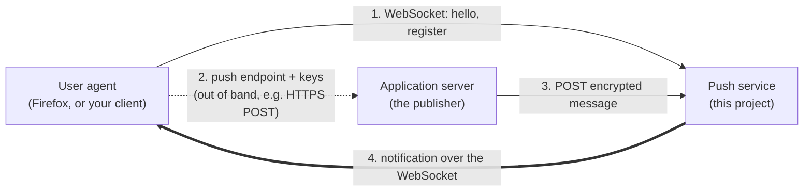
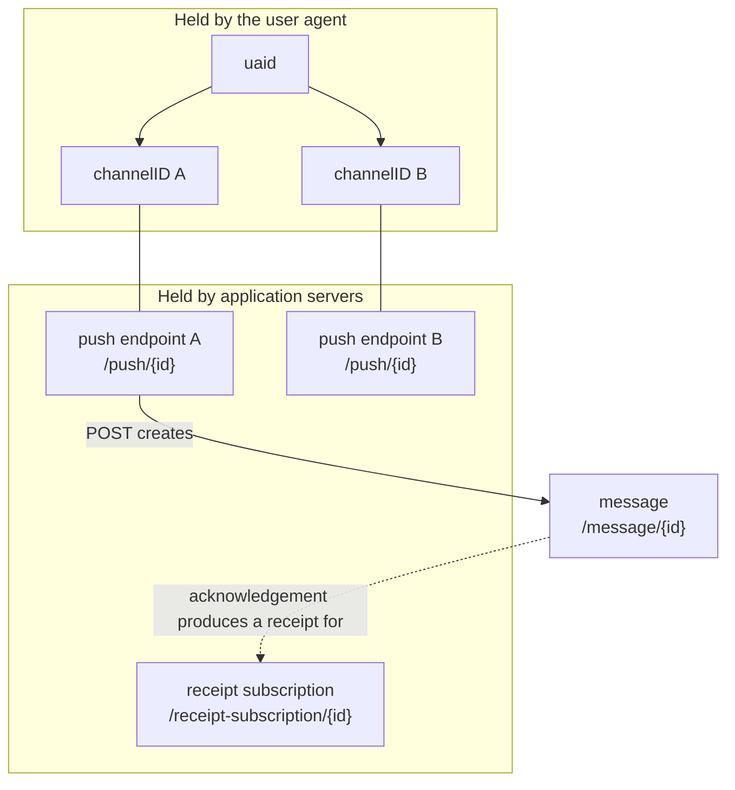
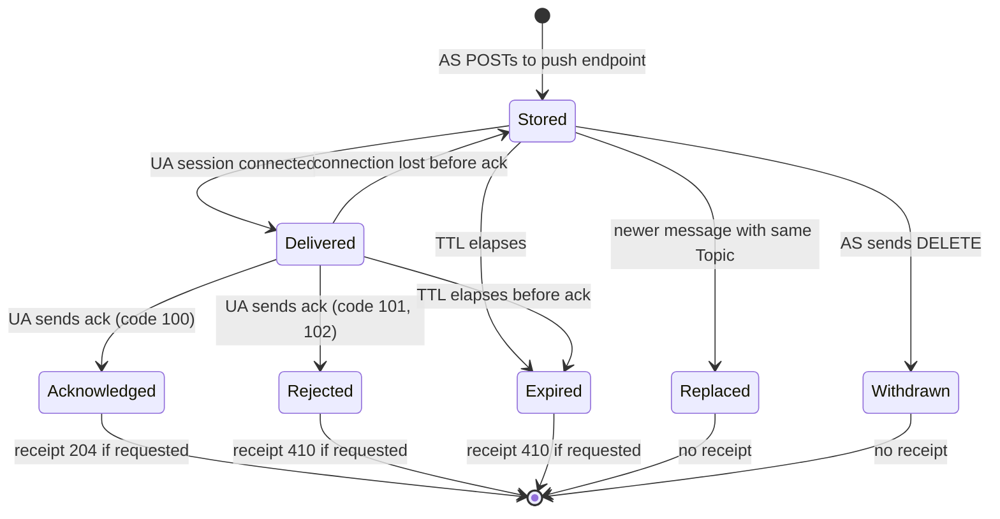

# Web Push concepts

Web Push lets a server send a message to an application on a device that is not currently running a connection to that server. The device keeps one connection open to a **push service**, and every application server that wants to reach the device sends its messages through that push service.

This page explains the actors and resources involved and how they relate.

## The specifications

| Specification | What it contributes | Status in this service |
|---|---|---|
| [RFC 8030](https://www.rfc-editor.org/rfc/rfc8030) Generic Event Delivery Using HTTP Push | Push requests, TTL, urgency, topics, receipts | Implemented for application servers. Its user agent side is replaced, see below |
| [RFC 8291](https://www.rfc-editor.org/rfc/rfc8291) Message Encryption for Web Push | End-to-end encryption between application server and user agent | Library module |
| [RFC 8188](https://www.rfc-editor.org/rfc/rfc8188) Encrypted Content-Encoding for HTTP | The `aes128gcm` format RFC 8291 builds on | Library module |
| [RFC 8292](https://www.rfc-editor.org/rfc/rfc8292) Voluntary Application Server Identification (VAPID) | How an application server identifies itself | Implemented |
| Mozilla push protocol | The WebSocket protocol Firefox speaks to its push service | Implemented for user agents |

RFC 8030 has two halves. The application server half, how messages are sent, is what every deployed push service accepts. The user agent half delivers messages with HTTP/2 server push, which Chrome and Firefox have since removed and which no browser ever used for Web Push. This service therefore speaks Firefox's WebSocket protocol to user agents, so a stock Firefox can use it. [Architecture](architecture.md#why-the-user-agent-side-is-a-websocket) explains the decision.

## The three actors

- **User agent (UA).** The client on the device, usually a browser. It subscribes and receives messages. The rest of these docs also call it *the client*.
- **Application server (AS).** The backend that sends messages to the user, for example a chat service. These docs also call it *the publisher*.
- **Push service.** The relay between them. It stores messages until the user agent is reachable and delivers them. It cannot read them: payloads are encrypted end to end.

The user agent decides which application servers get a push endpoint, and can restrict a subscription to one application server key.

## Identifiers and resources

| Name | Held by | What it is |
|---|---|---|
| `uaid` | User agent | The user agent's identity at the push service. Resumes a session and receives the messages of all its subscriptions |
| `channelID` | User agent | The user agent's name for one subscription, a UUID it chooses |
| Push endpoint | Application server | The URL an application server POSTs messages to. One per subscription |
| Message URL | Application server | Returned in `Location` for each accepted message. Reads or withdraws that message |
| Receipt subscription | Application server | A URL whose stream reports delivery receipts |

Every URL is a **capability**: holding it is the permission. There are no accounts and no API keys. Push endpoints are random and unrelated to the `uaid` and `channelID`, so an application server cannot tell which device a push endpoint belongs to, and two push endpoints of the same device cannot be linked. [Privacy and security](privacy-and-security.md) explains why this matters.

## Lifecycle of a message

1. **Stored.** The application server POSTs to the push endpoint. The push service stores the message for at most its time to live (TTL) and answers with a message URL.
2. **Delivered.** While the user agent has a session open, the push service sends the message as a `notification`. Delivery repeats on every new session until the user agent acknowledges.
3. **Acknowledged.** The user agent sends `ack`. If the application server asked for a receipt, it gets a `204`. A user agent that could not decrypt or show the message acknowledges with an error code, and the receipt is `410`.
4. **Expired.** A message that is not acknowledged within its TTL is never delivered again. A requested receipt reports `410`.
5. **Replaced or withdrawn.** A newer message with the same `Topic` replaces an undelivered one, and the application server can withdraw a message with `DELETE`. Neither produces a receipt.

## Message options

An application server controls delivery with request headers on the push:

| Header | Required | Effect |
|---|---|---|
| `TTL` | Yes | Seconds the push service keeps the message. `0` means deliver now or never |
| `Urgency` | No | `very-low`, `low`, `normal` (default), `high`. Validated and stored; the Firefox protocol has no way for a device to filter by it |
| `Topic` | No | Up to 32 base64url characters. A newer message with the same topic replaces the older one while it is undelivered |
| `Prefer: respond-async` | No | Request a delivery receipt |

None of these headers reach the user agent. [Sending a message](sending-a-message.md) explains each one.

## Next steps

- [Connecting a client](connecting-a-client.md): point Firefox at this service, or write your own client.
- [Connecting a publisher](connecting-a-publisher.md): prepare an application server.
- [Sending a message](sending-a-message.md): the complete path of one message.
