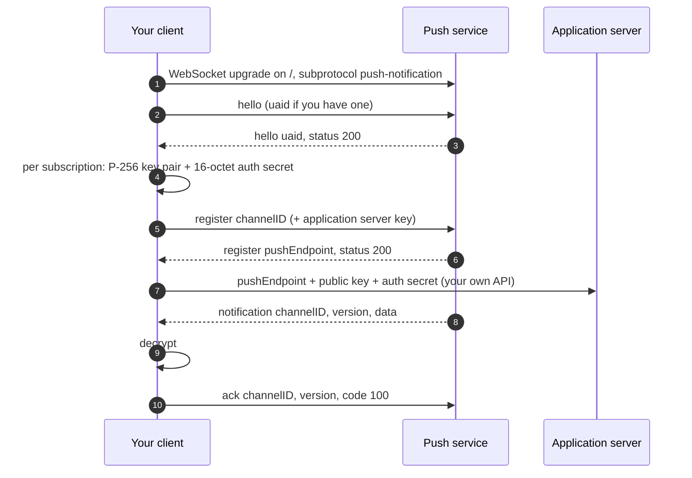

# Connecting a client

A client, called the user agent in the RFCs, holds one WebSocket to the push service, registers a subscription per application, and receives messages on that connection. This guide first points Firefox at this service, then explains the protocol for writing your own client.

## Prerequisites

- A running push service. [Running the service](running.md) sets one up on `https://localhost:8443`.
- For Firefox: a certificate Firefox trusts for that address. A self-signed certificate works once it is imported under **Settings > Privacy & Security > Certificates > View Certificates > Authorities**.
- For your own client: a WebSocket library and a P-256 implementation. The examples use Rust.

## Using Firefox

Firefox speaks this service's user agent protocol natively. To use it:

1. Open `about:config`.
2. Set `dom.push.serverURL` to `wss://localhost:8443/`, or your service's origin with `wss://`.
3. Restart Firefox.

From then on, `PushManager.subscribe()` on any site returns an endpoint on this service. A page subscribes in the usual way:

```javascript
const registration = await navigator.serviceWorker.register("/sw.js");
const subscription = await registration.pushManager.subscribe({
  userVisibleOnly: true,
  applicationServerKey: "your_vapid_public_key",
});
console.log(JSON.stringify(subscription));
```

The logged JSON contains the push endpoint and the encryption keys the application server needs:

```json
{
  "endpoint": "https://localhost:8443/push/FLhiBWT0-e7Hd6w8KEn1Qw",
  "keys": { "p256dh": "BCVx…", "auth": "BTBZ…" }
}
```

Firefox generates the keys, decrypts messages, and acknowledges them. Nothing else is required. To go back to Mozilla's service, reset `dom.push.serverURL`.

## Writing your own client

The rest of this guide covers what Firefox does internally, for clients that are not a browser. The [WebSocket protocol reference](websocket-protocol.md) lists every message and field.



### Opening a session

Connect to the service origin with `wss://`, path `/`, offering the `push-notification` subprotocol, then send `hello`:

```json
{"messageType": "hello", "use_webpush": true, "broadcasts": {}}
```

The service answers with a user agent id:

```json
{"messageType": "hello", "uaid": "5f1a9c0e2b7d4e8f9a6b3c2d1e0f7a8b", "status": 200, "use_webpush": true, "broadcasts": {}}
```

Store the `uaid` together with your subscriptions. On every later connection, send it in `hello` so the service can deliver messages that arrived while you were offline:

```json
{"messageType": "hello", "uaid": "5f1a9c0e2b7d4e8f9a6b3c2d1e0f7a8b", "use_webpush": true, "broadcasts": {}}
```

If the reply contains a different `uaid`, the service does not know yours any more: drop all stored subscriptions and register again. A client without subscriptions can omit `uaid` and receive a fresh one each time, which is what Firefox does to avoid a persistent identifier.

Only one session per `uaid` is active. Connecting again with the same `uaid` closes the older connection.

### Generating encryption keys

Messages are encrypted end to end ([RFC 8291](https://www.rfc-editor.org/rfc/rfc8291)), so each subscription needs a P-256 key pair and a random 16-octet authentication secret:

```rust
use p256::{SecretKey, elliptic_curve::{rand_core::{OsRng, RngCore}, sec1::ToEncodedPoint}};

let ua_key = SecretKey::random(&mut OsRng);
let ua_public: [u8; 65] = ua_key.public_key().to_encoded_point(false).as_bytes().try_into()?;
let ua_private: [u8; 32] = ua_key.to_bytes().into();

let mut auth_secret = [0u8; 16];
OsRng.fill_bytes(&mut auth_secret);
```

`ua_public` and `auth_secret` go to the application server, and nobody else. `ua_private` never leaves the device. The push service never sees any of the three.

### Registering a subscription

Choose a random UUID as the channel id and send `register`. To restrict the subscription to one application server, include its VAPID public key as `key`, base64url encoded:

```json
{"messageType": "register", "channelID": "d9b74644-4f97-46aa-b8fa-9393985cd6cd", "key": "BA1Hxzyi1RUM1b5wjxsn7nGxAszw2u61m164i3MrAIxHF6YK5h4SDYic-dRuU_RCPCfA5aq9ojSwk5Y2EmClBPs"}
```

The reply contains the push endpoint:

```json
{"messageType": "register", "channelID": "d9b74644-4f97-46aa-b8fa-9393985cd6cd", "status": 200, "pushEndpoint": "https://localhost:8443/push/FLhiBWT0-e7Hd6w8KEn1Qw"}
```

| Status | Meaning |
|---|---|
| `200` | Registered. Registering the same channel again with the same key returns the same endpoint |
| `400` | The channel id is not a UUID, or the key is not an uncompressed P-256 point |
| `409` | The channel is already registered with a different key |

A restricted subscription only accepts pushes signed by that key, so a leaked endpoint is useless to anyone else.

### Handing the subscription to the application server

Send the push endpoint, `ua_public`, and `auth_secret` to your application server over an authenticated HTTPS request. Most server libraries expect the W3C Push API shape shown in [Using Firefox](#using-firefox). Never send the `uaid`.

### Receiving and acknowledging messages

Messages arrive on the session as `notification` messages:

```json
{"messageType": "notification", "channelID": "d9b74644-4f97-46aa-b8fa-9393985cd6cd", "version": "QVUEoVnQK-l6vV-5Y95_7A", "data": "DGv6ra1n…", "headers": {"encoding": "aes128gcm"}}
```

- `channelID` names the subscription.
- `version` identifies the message. Keep it to acknowledge.
- `data` is the encrypted body in base64url. It is absent when the application server sent an empty body.
- `headers.encoding` is the body's content coding, `aes128gcm` for Web Push.

Decrypt the body with the subscription's keys:

```rust
use base64::{Engine, engine::general_purpose::URL_SAFE_NO_PAD};
use webpush_service::ece::webpush;

let body = URL_SAFE_NO_PAD.decode(data.trim_end_matches('='))?;
let plaintext = webpush::decrypt(&ua_private, &auth_secret, &body)?;
```

Then acknowledge it. Until you do, the service sends the message again on every new session:

```json
{"messageType": "ack", "updates": [{"channelID": "d9b74644-4f97-46aa-b8fa-9393985cd6cd", "version": "QVUEoVnQK-l6vV-5Y95_7A", "code": 100}]}
```

| Code | Meaning | Effect |
|---|---|---|
| `100` | Handled | The message is deleted. A requested receipt reports `204` |
| `101` | Decryption failed | The message is deleted. A requested receipt reports `410` |
| `102` | Not delivered, for example no permission to show it | The message is deleted. A requested receipt reports `410` |

Duplicates are possible after a reconnect. Discard messages whose `version` you already handled.

### Unsubscribing

Send `unregister` with the channel id. The reply always has status `200`:

```json
{"messageType": "unregister", "channelID": "d9b74644-4f97-46aa-b8fa-9393985cd6cd", "code": 200}
```

The push endpoint returns `404` from then on, which tells application servers to forget it.

### Keeping the connection alive

Send `{}` when the connection has been idle. The service answers `{}`. Firefox pings every 30 minutes and treats a missing answer within 10 seconds as a dead connection.

## Next steps

- [WebSocket protocol reference](websocket-protocol.md) lists every message.
- [Connecting a publisher](connecting-a-publisher.md) covers the application server side.
