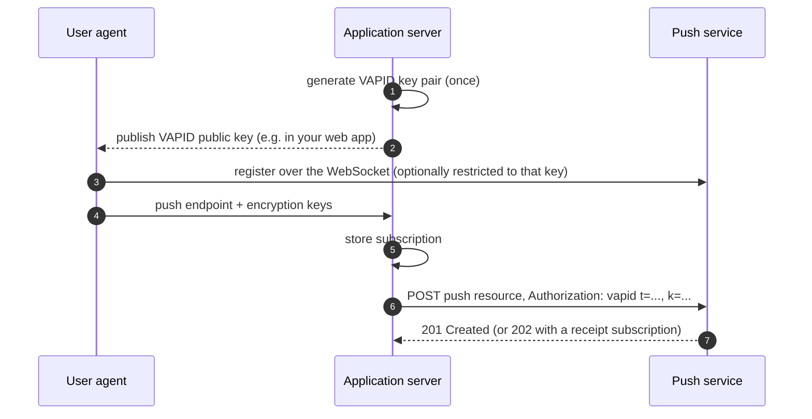

# Connecting a publisher

A publisher, called the application server in the RFCs, is the backend that sends messages to user agents. It never talks to the device directly: it POSTs encrypted messages to a push resource and the push service delivers them.

This guide prepares an application server: an identity key, storage for subscriptions, signed requests, and delivery receipts. [Sending a message](sending-a-message.md) then covers the message itself.

## Prerequisites

- A running push service. [Running the service](running.md) sets one up on `https://localhost:8443`.
- An HTTPS endpoint on your application server where clients can register subscriptions.
- For the Rust examples: the `p256`, `base64`, and `serde_json` crates. They match the versions this project depends on.

## Overview



## Creating an identity key

Voluntary Application Server Identification (VAPID, [RFC 8292](https://www.rfc-editor.org/rfc/rfc8292)) identifies your application server with a long-lived P-256 key pair. You create it once and reuse it for every message. Push services use it to attribute traffic and to enforce restricted subscriptions.

To generate a key and keep it as base64url text, run this once and store the output in your secret manager:

```rust
use base64::{Engine, engine::general_purpose::URL_SAFE_NO_PAD as B64};
use p256::{ecdsa::SigningKey, elliptic_curve::{rand_core::OsRng, sec1::ToEncodedPoint}};

let key = SigningKey::random(&mut OsRng);
let private_b64 = B64.encode(key.to_bytes());
let public_b64 = B64.encode(key.verifying_key().to_encoded_point(false).as_bytes());
```

`private_b64` is the secret. `public_b64` is the 87-character value clients pass as the `vapid` subscription option, and the value of the `k` parameter on every push.

If you prefer to manage the key with OpenSSL, generate a PEM key and derive the same public value from it:

```bash
openssl ecparam -name prime256v1 -genkey -noout -out vapid_private.pem
openssl ec -in vapid_private.pem -pubout -outform DER | tail -c 65 | base64 | tr '/+' '_-' | tr -d '=\n'
```

The second command strips the DER prefix, leaving the 65-octet uncompressed point, and converts it to unpadded base64url.

Publish the public key wherever your client code can read it. A client that passes it when subscribing creates a restricted subscription, which only accepts pushes signed by your key.

## Storing subscriptions

Each client registers three values with your application server. The usual JSON shape, from the W3C Push API, is:

```json
{
  "endpoint": "https://localhost:8443/push/FLhiBWT0-e7Hd6w8KEn1Qw",
  "keys": { "p256dh": "base64url public key", "auth": "base64url auth secret" }
}
```

| Field | Use |
|---|---|
| `endpoint` | The push resource. POST messages here |
| `keys.p256dh` | The client's P-256 public key, for encryption |
| `keys.auth` | The client's 16-octet authentication secret, for encryption |

Treat all three as secrets. Anyone holding the endpoint can send to an unrestricted subscription, and the keys let them produce messages the client accepts. Store them encrypted at rest and keyed by your own user id.

## Signing requests

Every push includes an `Authorization` header built from a short-lived JSON Web Token (JWT) signed with your VAPID key:

```text
Authorization: vapid t=<header>.<claims>.<signature>, k=<public key>
```

| Part | Content |
|---|---|
| JWT header | `{"typ":"JWT","alg":"ES256"}`. ES256 is the only accepted algorithm |
| `aud` claim | The origin of the push resource: scheme, host, and port, for example `https://localhost:8443` |
| `exp` claim | Expiry in Unix seconds, at most 24 hours ahead |
| `sub` claim | Optional contact for the push service operator, a `mailto:` or `https:` URI |
| signature | ES256 over `<header>.<claims>`, as the raw 64-octet `r ‖ s`, not DER |
| `k` | Your public key, base64url |

The following function builds the header value for one push resource:

```rust
use base64::{Engine, engine::general_purpose::URL_SAFE_NO_PAD as B64};
use p256::{ecdsa::{Signature, SigningKey, signature::Signer}, elliptic_curve::sec1::ToEncodedPoint};

fn vapid_authorization(key: &SigningKey, push_url: &str, now: u64) -> Result<String, Box<dyn std::error::Error>> {
    let uri: http::Uri = push_url.parse()?;
    let origin = format!("{}://{}", uri.scheme_str().ok_or("no scheme")?, uri.authority().ok_or("no host")?);

    let header = B64.encode(r#"{"typ":"JWT","alg":"ES256"}"#);
    let claims = serde_json::json!({ "aud": origin, "exp": now + 12 * 3600, "sub": "mailto:ops@example.com" });
    let signing_input = format!("{header}.{}", B64.encode(claims.to_string()));

    let signature: Signature = key.sign(signing_input.as_bytes());
    let public = B64.encode(key.verifying_key().to_encoded_point(false).as_bytes());
    Ok(format!("vapid t={signing_input}.{}, k={public}", B64.encode(signature.to_bytes())))
}
```

How it works:

- `aud` is derived from the push resource URL, because push services check it against their own origin. A token for one push service is useless at another.
- `exp` is 12 hours out. Tokens up to 24 hours ahead are valid, and a margin absorbs clock skew. You can cache one token per push service origin until shortly before it expires.
- `signature.to_bytes()` produces the fixed-size `r ‖ s` form JWS requires. A DER-encoded signature is rejected.

VAPID is optional for unrestricted subscriptions, but always send it. Push services can contact you through `sub`, and invalid credentials are rejected with `403` even when the subscription does not require them.

## Requesting delivery receipts

To learn whether a message reached the device, add `Prefer: respond-async` to the push. The push service answers `202` instead of `201` and links a receipt subscription:

```text
HTTP/2 202
location: https://localhost:8443/message/gSKXfdV8jcmZ0HKx2r5--A
ttl: 60
link: <https://localhost:8443/receipt-subscription/vfqjHA-BlQmJsjiEjDSOYg>; rel="urn:ietf:params:push:receipt"
```

Reuse that receipt subscription for later pushes by sending it back in a `Link` header, so all receipts arrive on one stream:

```text
Prefer: respond-async
Link: <https://localhost:8443/receipt-subscription/vfqjHA-BlQmJsjiEjDSOYg>; rel="urn:ietf:params:push:receipt"
```

To receive receipts, send a `GET` to the receipt subscription. The response is a Server-Sent Events stream that stays open, so any HTTP client can read it. With `curl`, `-N` turns off buffering:

```bash
curl -N https://localhost:8443/receipt-subscription/your_receipt_subscription_id
```

Each receipt is one event:

```text
event: receipt
id: 1758561234000000
data: {"message":"https://localhost:8443/message/gSKXfdV8jcmZ0HKx2r5--A","status":204}
```

| `status` | Meaning |
|---|---|
| `204` | The client acknowledged the message |
| `410` | The message expired, the subscription was deleted, or the client reported that it could not decrypt or show the message |

`message` is the URL you received in `Location` when you sent the message. Receipts that occur while no stream is open are queued and sent when you connect, oldest first. Each receipt is sent once. A message replaced through its `Topic`, or withdrawn with `DELETE`, produces no receipt.

To collect queued receipts without holding a connection, add `Prefer: wait=0`. The stream then ends after the queued receipts, or the response is `204` when there are none. The stream sends a `: keepalive` comment every 30 seconds while idle, and an `event: gone` before it ends because the receipt subscription was deleted.

## Handling responses

| Status | Meaning | What to do |
|---|---|---|
| `201` | Accepted | Nothing. `Location` is the message URL, `TTL` the lifetime actually granted |
| `202` | Accepted, receipt will follow | Remember `Location` to match the receipt |
| `400` | Malformed request | Fix the request: missing or malformed `TTL`, bad `Urgency` or `Topic`, unknown receipt subscription, or VAPID key equal to the encryption key id |
| `401` | Restricted subscription, no VAPID credentials | Add the `Authorization` header |
| `403` | VAPID credentials invalid, or not the key the subscription is restricted to | Check `aud`, `exp`, the signature format, and which key you used |
| `404` | The client unsubscribed | Delete the subscription from your storage. It will never work again |
| `413` | Body larger than 4096 octets | Send less. An encrypted payload holds up to 3993 octets of plaintext |

## Next steps

- [Sending a message](sending-a-message.md) covers encryption and the push request.
- [Privacy and security](privacy-and-security.md) explains what the push service can and cannot see.
