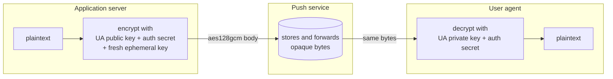
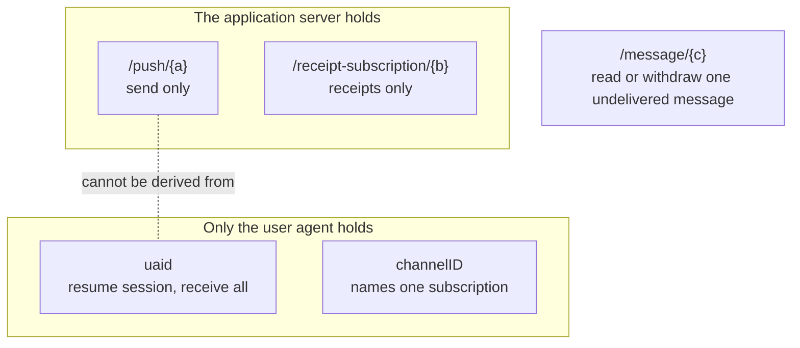

# Privacy and security

Every message between an application and a device passes through the push service, which makes it an attractive place to observe users. The Web Push RFCs are designed so that the push service learns as little as possible, application servers cannot track users across subscriptions, and nobody but the intended application server can reach a device.

This page explains which party can learn what, the mechanisms that enforce it, and what remains visible.

## What each party can see

| | Message content | Which app sent it | Which user it is for | When and how large |
|---|---|---|---|---|
| **Push service** | No: encrypted end to end | Only the VAPID key, if the sender uses one | No: only an opaque `uaid` and a network address | Yes |
| **Application server** | Yes, it wrote it | Yes | Only what your own login system tells it | Yes |
| **Another application server** | No | No | No | No |
| **Network observer** | No: TLS on every hop | No | No | Connection timing and sizes |

The rest of this page explains how each "No" is achieved.

## End-to-end encryption

The user agent generates the encryption keys and gives them only to the application server ([RFC 8291](https://www.rfc-editor.org/rfc/rfc8291)). The push service stores and forwards ciphertext. It never has the keys and never attempts decryption. The one thing it reads from the body is the header's key id, to reject a message whose encryption key equals the sender's VAPID key.

Two details protect the encryption itself:

- **Authentication secret.** Only the user agent and the application server know the 16-octet secret mixed into the key derivation. Someone who learns the user agent's public key alone still cannot produce a message it accepts.
- **Ephemeral keys.** The application server uses a fresh key pair and salt for every message, so compromising one message key reveals nothing about others.

## Capability URLs

There are no accounts, logins, or API keys in RFC 8030. Every resource an application server uses is a URL, and possessing the URL is the permission to use it. The design works because of three properties:

- **Unguessable.** Every id is 128 bits from the operating system's cryptographically secure random number generator, encoded as 22 base64url characters. RFC 8030 §8.3 asks for at least 120 bits.
- **Independent.** Push endpoint, message, and receipt subscription ids are generated separately, and separately from the `uaid`. None is derived from another, so holding one reveals nothing about the others.
- **Least privilege.** Each party receives only what it needs.

The practical consequence: an application server that holds a push endpoint can send messages and nothing else. It cannot read other messages, receive them, or unsubscribe the user. A message URL does not reveal which subscription it belongs to, because the push service resolves it through a separate index.

Because URLs are credentials, this service never writes them to logs. Request logs record the method, status, and latency only.

## The user agent id

The `uaid` is the one persistent identifier in the system: it ties a device's subscriptions together so one connection can receive them all. It is never part of a URL, and only the user agent and the push service know it.

Firefox limits its lifetime. While it has no subscriptions, it omits the `uaid` from `hello` and receives a new one on every connection. Only once it subscribes does it keep one `uaid` across connections.

## Unlinkability

A user agent that subscribes for several applications gets unrelated push endpoints for each. Two application servers comparing their endpoints cannot tell that they reach the same device, and an endpoint contains no user or device information (RFC 8030 §8.2).

This is a deliberate difference from Mozilla's autopush, whose endpoints are the `uaid` and channel id, encrypted with a server key. Encrypted endpoints are only as unlinkable as that key is secret; random endpoints contain nothing to decrypt.

The user agent's network address is visible to the push service, like any server it connects to. Hiding it requires a proxy or VPN and is outside the protocol.

## Restricting who can send

An unrestricted push resource accepts messages from anyone who holds it. If it leaks, for example through a compromised application server database, anyone can send to the device. Encryption still prevents forged messages from decrypting, but the device still processes each attempt and spends battery.

Restricted subscriptions prevent this ([RFC 8292 §4](https://www.rfc-editor.org/rfc/rfc8292#section-4)). The user agent names the application server's VAPID public key in its `register` message, which Firefox does whenever a page passes `applicationServerKey`, and the push service then requires every push to include a valid token signed by that key:

| Push request | Result |
|---|---|
| No VAPID credentials | `401` with `WWW-Authenticate: vapid` |
| Credentials signed by another key | `403` |
| Expired token, token valid for more than 24 hours, wrong `aud`, bad signature | `403` |
| Valid credentials from the named key | Accepted |

The push service never stores or forwards the token or the key. A token is valid for one push service only, through `aud`, and expires within 24 hours, which limits the damage if one is captured. This service also rejects invalid credentials on unrestricted subscriptions, so a misconfigured application server fails loudly instead of silently sending unauthenticated traffic.

## Transport security

Every connection uses TLS 1.2 or 1.3, including the user agent WebSocket (`wss://`). There is no plaintext listener: a plain HTTP request to the service port gets no HTTP response. The push service also checks request sizes before buffering: bodies larger than 4096 octets are rejected with `413` while they are still being read.

## What remains visible

The protocol minimizes, but does not eliminate, what the push service learns:

- **Timing.** The push service sees when messages are sent and delivered, which can reveal usage patterns.
- **Size.** Ciphertext length follows plaintext length. The encryption in this project adds no padding. Application servers that send messages whose length reveals their content can pad the plaintext before encrypting, for example to a fixed size.
- **Sender identity.** A VAPID key identifies the sending application server to the push service, and the optional `sub` claim can name its operator. That is the purpose of VAPID. It does not identify the user.
- **Urgency, TTL, and topic.** These are plaintext request headers by necessity, because the push service acts on them. Choose topic names that do not describe content, such as `t1`, rather than `password-reset`.

## Limits of this implementation

| Area | Status |
|---|---|
| Rate limiting (RFC 8030 §8.4) | Not implemented. Deploy behind infrastructure that limits requests per push resource if you expose it publicly |
| Automatic subscription and user agent expiry | Not implemented. Subscriptions last until the user agent deletes them |
| Operator access to storage | Stored messages are ciphertext, but ids in storage are live capability URLs. Protect the database like any credential store |

## Next steps

- [Architecture](architecture.md) shows where each of these rules is enforced in the code.
- [Connecting a publisher](connecting-a-publisher.md#signing-requests) shows how to create VAPID tokens.
