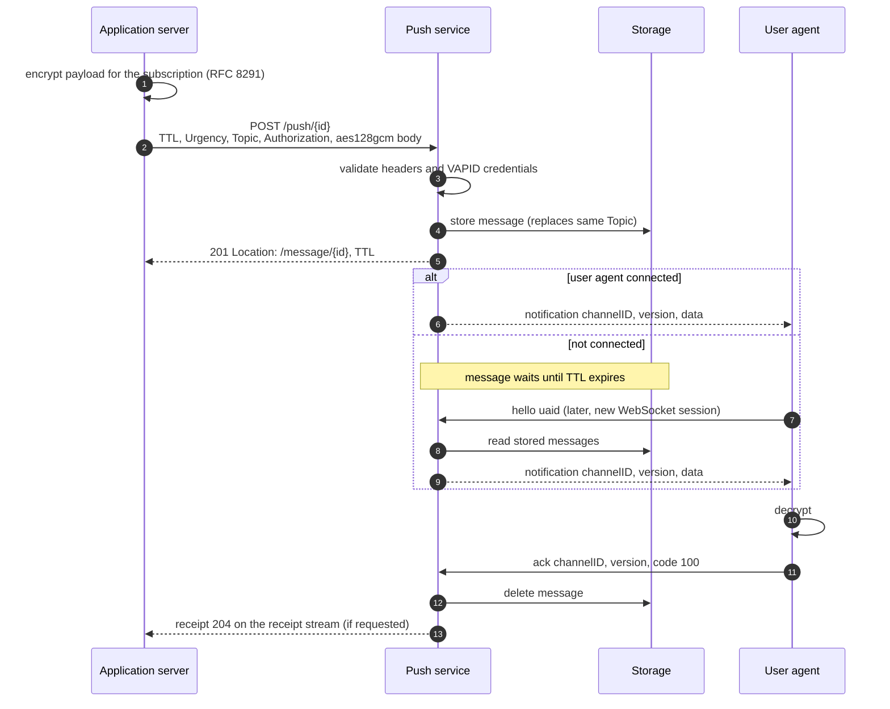
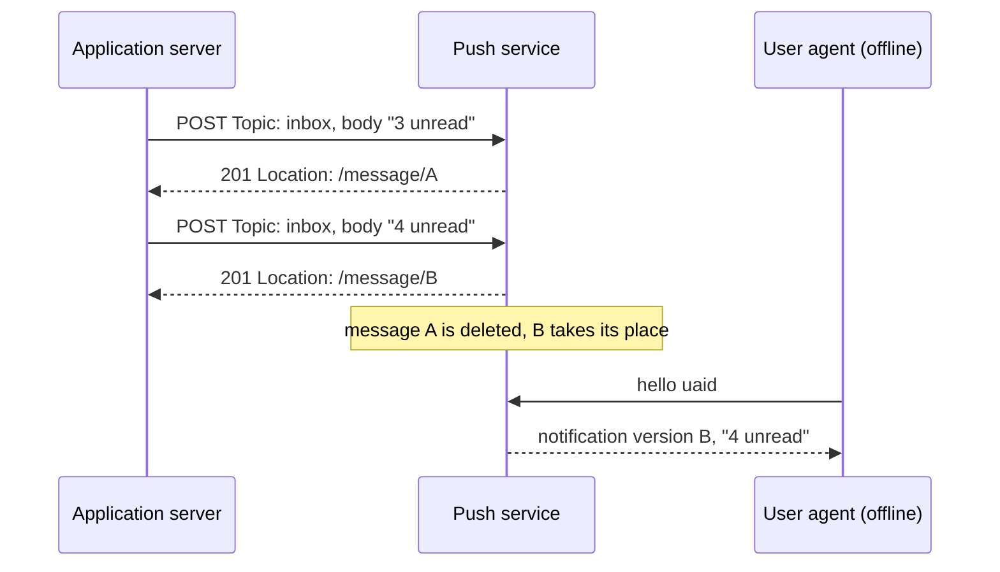

# Sending a message

This page follows one message from the application server to the device: encryption, the push request, storage, delivery, acknowledgement, and the receipt. It assumes a client that has subscribed ([Connecting a client](connecting-a-client.md)) and an application server that holds the subscription and a VAPID key ([Connecting a publisher](connecting-a-publisher.md)).

## The complete path



## Encrypting the payload

The push service forwards the body byte for byte and never decrypts it. Encryption happens on the application server with the client's public key and authentication secret ([RFC 8291](https://www.rfc-editor.org/rfc/rfc8291)).

For every message, generate a fresh ephemeral key pair and a fresh salt, then encrypt:

```rust
use p256::{SecretKey, elliptic_curve::rand_core::{OsRng, RngCore}};
use webpush_service::ece::webpush;

let ephemeral: [u8; 32] = SecretKey::random(&mut OsRng).to_bytes().into();
let mut salt = [0u8; 16];
OsRng.fill_bytes(&mut salt);

let body = webpush::encrypt(&ua_public, &auth_secret, &ephemeral, &salt, b"You have a new message")?;
std::fs::write("message.bin", &body)?;
```

What each input does:

- `ua_public` and `auth_secret` are the subscription's `p256dh` and `auth` values, decoded from base64url.
- `ephemeral` is a one-time key for this message only. Its public half is embedded in the body header, so the client can derive the same key. Never use your VAPID key here: the push service rejects a message whose embedded key equals the VAPID `k` with `400`, because reusing the identity key for encryption links the two.
- `salt` must be random per message. Reusing a salt with the same keys reuses the AES-GCM key and nonce.

The result is at most 4096 octets: an 86-octet header, the plaintext, one padding delimiter octet, and a 16-octet authentication tag. That leaves 3993 octets for plaintext.

## Sending the push request

POST the encrypted body to the subscription's push resource. The following request asks the push service to keep the message for one hour, marks it as normal urgency, and replaces any undelivered message on the `inbox` topic:

```bash
curl --http2 -i -X POST https://localhost:8443/push/your_push_id \
  -H 'TTL: 3600' \
  -H 'Urgency: normal' \
  -H 'Topic: inbox' \
  -H 'Content-Encoding: aes128gcm' \
  -H 'Content-Type: application/octet-stream' \
  -H "Authorization: $(cat vapid_authorization.txt)" \
  --data-binary @message.bin
```

`vapid_authorization.txt` holds the value produced by the signing function in [Signing requests](connecting-a-publisher.md#signing-requests). HTTP/1.1 works as well as HTTP/2 for sending.

The push service answers:

```text
HTTP/2 201
location: https://localhost:8443/message/QVUEoVnQK-l6vV-5Y95_7A
ttl: 3600
```

`Location` identifies the message. `ttl` is the lifetime the push service actually granted, which can be lower than requested.

## Choosing delivery options

### TTL

`TTL` is required, in seconds. The push service keeps the message that long and never delivers it afterwards.

| Value | Behavior |
|---|---|
| `0` | Delivered only if the client is connected at this moment. Otherwise dropped |
| `1` to the service maximum | Stored and delivered whenever the client connects within that time |
| Above the maximum | Reduced to the maximum (60 days here). The response `TTL` shows the value used |

Values that are not plain digits give `400`. Pick a TTL that matches how long the message stays useful: a call notification is worthless after 30 seconds, a new-mail badge is not.

### Urgency

`Urgency` tells the device how important the message is: `very-low`, `low`, `normal`, or `high`. Messages without the header count as `normal`. A device on battery can ask the push service for only `high` messages, and receives the rest later. Any other value, or more than one value, gives `400`.

### Topic

`Topic` names a slot for messages that supersede each other, such as an unread counter. When a message arrives with a topic that already has an undelivered message on the same subscription, the new one replaces it:



The replacement gets a new URL, and the old URL returns `404`. The replacement's TTL, urgency, and receipt settings apply, and the replaced message never produces a receipt. Topics are 1 to 32 characters from the base64url alphabet (`A-Z a-z 0-9 - _`).

## Delivery to the device

If the client has a session open, the push service sends the message immediately. Otherwise it stays in storage, and the next session the client opens receives every stored message that has not expired, oldest first.

The client receives only what it needs:

```json
{"messageType": "notification", "channelID": "d9b74644-4f97-46aa-b8fa-9393985cd6cd", "version": "QVUEoVnQK-l6vV-5Y95_7A", "data": "DGv6ra1n…", "headers": {"encoding": "aes128gcm"}}
```

| Field | Value |
|---|---|
| `channelID` | The subscription the message was sent to |
| `version` | The message id, the last segment of the `Location` you received |
| `data` | The body exactly as you sent it, base64url. Absent for an empty body |
| `headers.encoding` | Your `Content-Encoding`, if you sent one |

`TTL`, `Urgency`, `Topic`, `Content-Type`, and the `Authorization` header are never forwarded. `Urgency` is validated and stored, but the WebSocket protocol gives the device no way to filter by it.

## Acknowledgement and receipts

Delivery is at least once. The push service keeps a delivered message until the client acknowledges it, and sends it again on every new session until then. Clients therefore acknowledge after handling a message, and tolerate duplicates.

If the push request included `Prefer: respond-async`, the acknowledgement produces a `204` receipt on the receipt subscription. A message that expires first, whose subscription is deleted first, or that the client reports it could not decrypt or show, produces a `410` receipt instead. [Requesting delivery receipts](connecting-a-publisher.md#requesting-delivery-receipts) shows how to receive them.

## Withdrawing a message

To take back a message that has not been delivered yet, send a `DELETE` to its `Location`:

```bash
curl -i -X DELETE https://localhost:8443/message/your_message_id
```

`204` confirms it: the message will not be delivered, and it produces no receipt. `404` means it was already acknowledged, expired, replaced, or withdrawn.

## Troubleshooting

| Symptom | Likely cause |
|---|---|
| `400` on every push | `TTL` missing, or not plain digits |
| `400` only on encrypted pushes with VAPID credentials | The body's key id equals your VAPID `k`. Use an ephemeral key for encryption |
| `401` | The subscription is restricted and the request has no VAPID `Authorization` |
| `403` | `aud` does not match the push service origin, `exp` is past or more than 24 hours ahead, the signature is DER encoded, or you signed with a different key than the subscription expects |
| `404` | The client unsubscribed. Delete the subscription on your side |
| Message never arrives | TTL too short for how long the device is offline, or TTL `0` while it was offline |
| Client cannot decrypt | Wrong `p256dh` or `auth` value, or the salt or ephemeral key was reused incorrectly |

## Next steps

- [Privacy and security](privacy-and-security.md) explains what each party can learn.
- [HTTP reference](http-reference.md) lists every header and status code.
